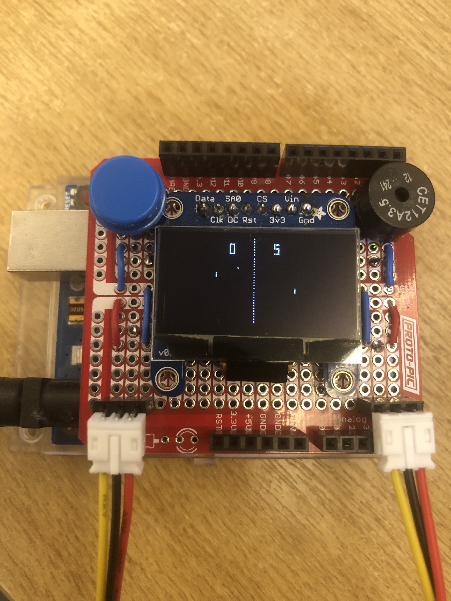
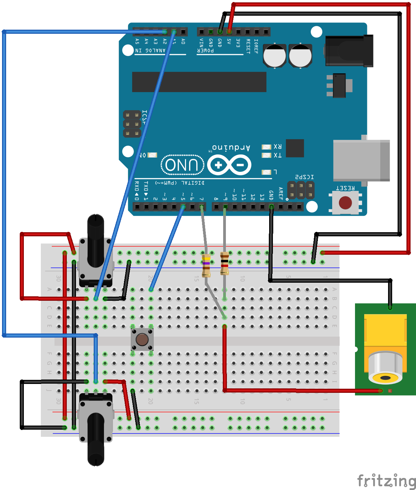

# Pong

An Arduino port of [pypaddle](https://github.com/arpruss/pypaddle), which is "a paddle ball bouncing game very similar to Pong".

This version can use an OLED display, or a TV via the TVout library.

## Background

I was inspired to build an Arduino OLED version of Pong after reading [this post by Benjamin Woehrl](https://medium.com/@ruction/arduino-pong-i2c-oled-128x64-bd4185970b50).

After I built it, I came across this [project for building paddle game controllers](https://www.instructables.com/USB-Paddle-Game-Controller/). The author, arpruss, wrote a Python (pygame) implementation of Pong that used the controllers he'd made, and which went to great lengths to reproduce the timings and behaviour of the original. His source for these details included an incredibly in-depth [circuit analysis of the original Atari Pong game](http://www.pong-story.com/LAWN_TENNIS.pdf), by Dr. H. Holden. Before I saw this I hadn't realised that Pong was implemented using TTL chips, rather than a microprocessor.

The code here is a port of the pypaddle pygame implementation to C++ suitable for running on an Arduino. The original pypaddle code is written so that it can scale to different screen sizes, and the timing code is independent of the speed of the update loop, which means that the experience of playing it on a regular machine using pypaddle, or the port on an Arduino with an OLED screen or a TV is virtually indistinguishable.

I also stumbled across this amazing [electronic circuit simulator in Javascript](http://falstad.com/circuit/). I encourage you to have a look at all the examples, but the [Pong simulation](https://www.falstad.com/pong/) is something else. You can even [play a limited form of the game in the browser](https://www.falstad.com/pong/vonly.html)!

## OLED version

### Parts list

- 1x Arduino Uno and power supply
- 1x Mini breadboard
- 1x Adafruit Monochrome 1.3" 128x64 OLED graphic display
- 2x Rotary potentiometer 10kΩ (e.g. Pimoroni NH00N2CB10K)
- 2x Knob
- 1x Push button
- 1x Buzzer - 5V
- 2x JST-PH Jumper Assembly (3 Wire)
- Jumper wires
- Solid core wire
- Solder
- (Optional) 1x Proto shield or Breadboard shield (e.g. Proto-PIC PPBBSFAR3)

### Wiring

Here's the first version I built on a breadboard:

The controllers are just potentiometers soldered to a JST-PH connector to make it easy to detach them from the breadboard or proto shield.

I used the SPI interface to the OLED, this is explained in detail in the [Adafruit documentation](https://learn.adafruit.com/monochrome-oled-breakouts/wiring-128x64-oleds).

Here's the breadboard wiring diagram:

<!--  -->

I then transferred the circuit to a proto shield. This is much more compact, and makes it easier to play since the controllers are now either side of the screen.

## TVout version

After I got the OLED version working, I updated the code so it could work using the TVout library. Since the picture stored in memory is 128x96 pixels (black or white), that's 12,288 bits, or 1,536 bytes. The Arduino Uno only has 2K of SRAM, so that's less than half a kilobyte left for the game itself. To get it to fit I had to use program memory for the digit segment data. (The [Arduino Memory Guide](https://docs.arduino.cc/learn/programming/memory-guide) is well worth a read to understand the different types of memory an Arduino has.)

Amazingly the TVout library just needs a couple of resistors and a connector to hook up to a TV.

### Parts list

The parts list is not very different from the OLED version. Instead of the OLED graphic display I used a TV with a composite video input, and the following parts.

- 1x Resistor, 470Ω
- 1x Resistor, 1kΩ
- 1x RCA/Phono jack socket
- 1x Composite video cable

For the RCA socket I de-soldered one from a very old broken Raspberry Pi board I had lying around.

### Wiring

Here's the breadboard wiring diagram:

## Code

Both the OLED and TVout version use the same codebase. You just need to change a `#define` at the top to compile for one or the other.

[pong.ino](pong.ino)

I used version 2.3.1 of the Adafruit SSD1306 library for the OLED display.

There are several versions and forks of the TVout library. I manually installed the one from https://github.com/nootropicdesign/arduino-tvout, from the people behind the wonderful [Hackvision](https://nootropicdesign.com/hackvision/) (which, BTW, also has an implementation of Pong).
